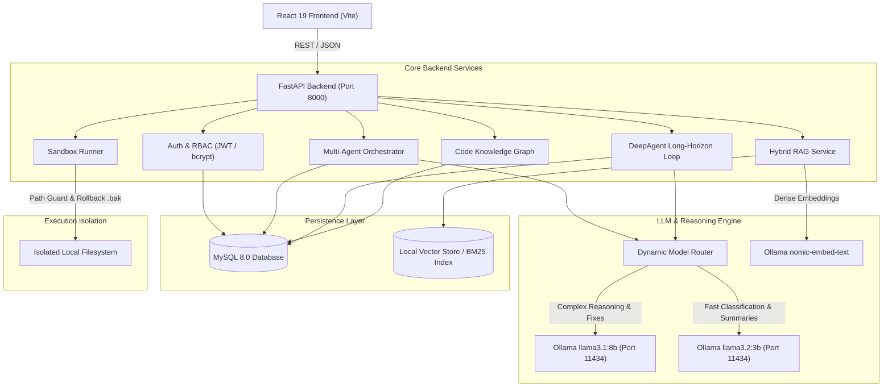

# CodeAware AI — System Architecture & Technical Specifications

This document outlines the system architecture, component relationships, data flows, and design principles of **CodeAware AI**.



---

## 1. Architectural Layers

### 1.1 Presentation Layer (`frontend/`)
- **Technology**: React 19, Vite 8, Tailwind/Vanilla CSS, Lucide Icons, React Router 7.
- **Key Modules**:
  - `RepoWorkspace.jsx`: Unified repository intelligence console with file browser, AST symbols, and commit graph.
  - `DeepAgentWorkspace.jsx`: Autonomous long-horizon execution tracker displaying goals, iterations, plan updates, and terminal output.
  - `Bugs.jsx`: Bug tracker and patch verification interface.
  - `CodeGraph.jsx`: Interactive visual knowledge graph with force-directed physics.
  - `SecurityDashboard.jsx`: OWASP vulnerability report and mitigation advice.

### 1.2 API Gateway & Routing (`backend/app/api/`)
- **Framework**: FastAPI with asynchronous request dispatch and Pydantic v2 schemas.
- **Contract Compatibility**: Every route is mounted at both the root level (e.g., `/repositories/list`) and under the `/api` prefix (e.g., `/api/repositories/list`).
- **Core Endpoints**:
  - `/auth`: Registration, JWT authentication, and team roles.
  - `/repositories`: Cloning, local indexing, deletion, and file tree exploration.
  - `/files`: Path-traversal-guarded file retrieval and syntax highlighting.
  - `/deep-agent`: Long-horizon autonomous engineering loop execution.
  - `/agents`: 21 specialized single-responsibility engineering agents.
  - `/rag`: Hybrid keyword (BM25) and dense vector code retrieval with line citations.
  - `/security`: Vulnerability scanning and persistent MySQL findings.
  - `/impact`: Symbol blast radius and dependency ripple calculation.
  - `/git`: Branch analysis, commit history, and difference visualizers.
  - `/ollama`: Real-time health, connection checks, and model enumeration.

### 1.3 Multi-Agent Collaboration Engine (`backend/app/ai/` & `backend/app/agents/`)
- **Orchestrator**: `CodeAwareOrchestrator` performs query intent classification, task decomposition, and dynamic agent delegation.
- **DeepAgent**: Self-directed loop with maximum iteration bounds, execution budgets, plan revision, and test-driven validation.
- **21 Specialist Agents**: Each encapsulates domain-specific system prompts, tool allowlists, and structured output parsing.

### 1.4 LLM Model Router (`backend/app/llm/`)
- **Zero Cloud Dependencies**: Connects to local Ollama server running on `http://localhost:11434`.
- **Dynamic Routing**:
  - `llama3.1:8b`: High-complexity reasoning, patch generation, and architecture audits.
  - `llama3.2:3b`: Fast classification, intent extraction, and summaries.
  - `nomic-embed-text`: High-density semantic vector embeddings.

### 1.5 Persistence & Database Layer (`backend/app/db/` & `backend/app/models/`)
- **Database**: MySQL 8.0 with utf8mb4 collation.
- **ORM**: SQLAlchemy 2.x with declarative mappings.
- **Migrations**: Alembic version-controlled schema tracking in `backend/alembic/`.
- **Key Tables**: `users`, `repositories`, `repository_files`, `repository_commits`, `analysis_runs`, `issues`, `security_findings`, `review_records`, `test_runs`, `patches`, `agent_runs`, `audit_logs`, `graph_nodes`, and `graph_edges`.

### 1.6 Secure Sandbox (`backend/app/sandbox/`)
- **Path Traversal Guard**: Prevents escaping repository boundaries (`SecuritySandboxException`).
- **Command Allowlist**: Restricts execution to authorized tools (`pytest`, `unittest`, `npm`, `ruff`, `black`, `mypy`).
- **Automated Rollbacks**: Automatically creates timestamped `.bak` files prior to file modification.

---

## 2. Directory Structure

```text
CODEAWARE/
├── .github/workflows/ci.yml     # Automated CI pipeline
├── backend/
│   ├── alembic/                 # Database migration scripts
│   ├── app/
│   │   ├── agents/              # 21 Specialist AI Agents
│   │   ├── ai/                  # Multi-agent collaboration & planning
│   │   ├── analysis/            # AST parsers & code scanners
│   │   ├── api/                 # FastAPI REST route handlers
│   │   ├── config/              # Central configuration & settings
│   │   ├── core/                # Security, logging, and middleware
│   │   ├── db/                  # Database connections & models
│   │   ├── deep_agent/          # Long-horizon execution engine
│   │   ├── graph/               # Code knowledge graph generators
│   │   ├── llm/                 # Ollama integration & Model Router
│   │   ├── ml/                  # Intent classification & scoring
│   │   ├── models/              # Relational database entities
│   │   ├── rag/                 # Chunker, retriever & vector store
│   │   ├── sandbox/             # Process isolation & patch backups
│   │   ├── services/            # Business logic service classes
│   │   └── tools/               # Typed tool registry
│   ├── pyproject.toml           # Backend package configuration
│   └── requirements.txt         # Traditional pip fallback
├── data/                        # Local indexes, graphs & embeddings
├── frontend/
│   ├── src/
│   │   ├── api/                 # Axios HTTP client endpoints
│   │   ├── components/          # Reusable UI widgets & viewers
│   │   ├── context/             # Auth, repo & theme contexts
│   │   └── pages/               # Top-level workspace views
│   ├── package.json             # Frontend dependencies
│   └── vite.config.js           # Vite development & build config
├── tests/                       # Pytest test suite (33 passing tests)
├── workspace/                   # Cloned repos & sandbox testing
├── .env.example                 # Example configuration template
├── .gitignore                   # Production git exclusions
├── ARCHITECTURE.md              # System design specifications
└── README.md                    # Quickstart & platform overview
```
