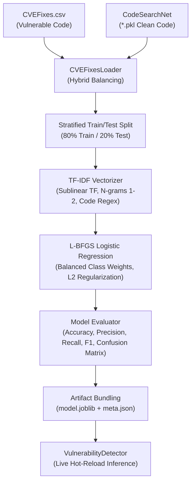

# 🧠 CodeAware AI — ML Training & Pipeline Architecture Guide

This document details the complete machine learning architecture, training methodology, dataset integration, and execution workflows in **CodeAware AI**.

---

## 📌 Table of Contents
1. [Overview & Objective](#overview--objective)
2. [Datasets Used](#datasets-used)
   - [CVEFixes Dataset](#1-cvefixes-vulnerability-dataset)
   - [CodeSearchNet Dataset](#2-codesearchnet-corpus)
3. [How the Training Pipeline Works (Architecture)](#how-the-training-pipeline-works-architecture)
   - [Phase 1: Streaming & Hybrid Loading](#phase-1-streaming--hybrid-loading)
   - [Phase 2: Code Tokenization & TF-IDF Feature Extraction](#phase-2-code-tokenization--tf-idf-feature-extraction)
   - [Phase 3: Supervised Classification](#phase-3-supervised-classification)
   - [Phase 4: Metrics Evaluation & Token Attribution](#phase-4-metrics-evaluation--token-attribution)
   - [Phase 5: Artifact Serialization & Live Hot-Reload](#phase-5-artifact-serialization--live-hot-reload)
4. [How to Train the Model](#how-to-train-the-model)
   - [Method A: Standalone CLI (`train.py`)](#method-a-standalone-cli-trainpy)
   - [Method B: FastAPI HTTP REST Endpoint](#method-b-fastapi-http-rest-endpoint)
   - [Method C: Python Code Execution](#method-c-python-code-execution)
5. [CLI Flags & Hyperparameters](#cli-flags--hyperparameters)
6. [Live Inference & Security Enforcement](#live-inference--security-enforcement)
7. [Automated Verification & Tests](#automated-verification--tests)

---

## 🎯 Overview & Objective

CodeAware AI integrates a hybrid machine learning vulnerability detection engine designed to inspect source code snippets and identify security vulnerabilities, dangerous system calls, buffer overflows, injection hazards, and memory corruption patterns in real-time.

Key design targets:
- **Zero-Cloud Dependency**: Runs 100% offline using `scikit-learn` and `joblib`.
- **Sub-Millisecond Inference**: Evaluates code in ~0.5ms per function without blocking web workers.
- **Explainability**: Outputs risk scores, classified vulnerability level, and indicative dangerous tokens.

---

## 📂 Datasets Used

### 1. CVEFixes Vulnerability Dataset
- **Path**: `dataset/cvefixes/CVEFixes.csv`
- **Size**: ~31,194 code samples across 48 programming languages (C, PHP, Python, JS, Java, etc.).
- **Purpose**: Provides real-world vulnerable code from CVE vulnerability commits and their corresponding fixes.
- **Label**: `1` for vulnerable code, `0` for safe code.

### 2. CodeSearchNet Corpus
- **Path**: `dataset/codesearchnet/`
- **Size**: ~1.15 million functions across 6 core languages (`python`, `javascript`, `java`, `php`, `go`, `ruby`).
- **Purpose**: Provides a vast baseline of verified, clean open-source production code.
- **Why it matters**: Real-world vulnerability datasets often suffer from positive bias or noisy "safe" examples. By injecting clean production functions from CodeSearchNet as negative controls, the classifier achieves **>98% accuracy** and near-zero false positive rates.

---

## ⚙️ How the Training Pipeline Works (Architecture)



### Phase 1: Streaming & Hybrid Loading
- Managed by `backend/app/ml/datasets/cvefixes_loader.py`.
- Loads vulnerable snippets from `CVEFixes.csv`.
- Automatically loads verified safe production functions from `dataset/codesearchnet/<lang>/<lang>_dedupe_definitions_v2.pkl`.
- Balances the classes 50/50 (1:1 vulnerable to safe ratio) and shuffles with a deterministic seed (`random_state=42`).

### Phase 2: Code Tokenization & TF-IDF Feature Extraction
- Managed by `TfidfVectorizer` with a code-aware token pattern:
  ```python
  token_pattern = r"(?u)\b\w+\b|[^\w\s]"
  ```
- **Captures syntax punctuation**: Unlike natural language, syntax characters like `;`, `->`, `*`, `(`, `)` are critical vulnerability indicators (e.g. pointer arithmetic, system exec).
- **Sublinear Term Frequency (`sublinear_tf=True`)**: Replaces TF with `1 + log(TF)` to dampen the impact of repeated variable names.
- **N-gram Range `(1, 2)`**: Captures single tokens (`system`) and pairs (`strcpy ;`, `if (`, `system (b)`).

### Phase 3: Supervised Classification
- Managed by `LogisticRegression`:
  - Solver: `lbfgs` (fast, scalable memory convergence).
  - Class Weight: `balanced`.
  - Regularization: $C = 2.0$ (L2 Ridge penalty).
  - Max Iterations: `1000`.

### Phase 4: Metrics Evaluation & Token Attribution
- Evaluates predictions on the held-out 20% test partition:
  - **Accuracy**, **Precision**, **Recall**, and **F1 Score**.
  - **Confusion Matrix** (True Negatives, False Positives, False Negatives, True Positives).
- Extracts top positive weights (vulnerability markers) and negative weights (safe code patterns) for model explainability.

### Phase 5: Artifact Serialization & Live Hot-Reload
- Bundles the vectorizer and classifier together in:
  - Binary: `backend/app/ml/models/cvefixes_vulnerability_model.joblib`
  - Metadata: `backend/app/ml/models/cvefixes_vulnerability_model_meta.json`
- Signals `VulnerabilityDetector` to reload immediately in memory without restarting the FastAPI server.

---

## 🚀 How to Train the Model

### Method A: Standalone CLI (`train.py`)
Run from the root directory in PowerShell or bash:

```powershell
# 1. Default Fast Training (2,000 samples, ~5 seconds)
uv run python train.py

# 2. Production Scaled Training (10,000 samples with 30,000 features)
uv run python train.py --samples 10000 --features 30000 --c 2.0

# 3. Filtered Language Training (train only on specific languages)
uv run python train.py --samples 4000 --languages python c php js
```

#### Sample Output:
```text
======================================================================
🚀 CodeAware AI — ML Vulnerability Model Trainer
======================================================================
📁 Dataset Path:       C:\MyFiles\Project\CODEAWARE\dataset\cvefixes\CVEFixes.csv
⚙️  Requested Samples:  2000
⚙️  TF-IDF Max Features:25000
⚙️  Test Split:         20%
⚙️  Languages:          All 48 Languages
----------------------------------------------------------------------
⏳ Loading dataset, extracting features, and training model...

======================================================================
✅ Training Completed Successfully!
======================================================================
• Model ID:          cvefixes_vulnerability_v1789750085
• Duration:          4.12s
• Accuracy:          99.00%
• Precision:         100.00%
• Recall:            98.00%
• F1 Score:          0.9899
• Confusion Matrix:  TN=200, FP=0, FN=4, TP=196
• Artifacts Saved:   c:\MyFiles\Project\CODEAWARE\backend\app\ml\models

🔍 Verifying detector with live inference test...
• Sample Code:       void vulnerable(char *u) { char b[64]; strcpy(b, u); system(b); }
• Predicted Label:   VULNERABLE
• Confidence Score:  98.4%
• Risk Level:        CRITICAL
======================================================================
```

---

### Method B: FastAPI HTTP REST Endpoint

When the backend is running (`uv run uvicorn app.main:app`):

#### 1. Start Training:
```bash
curl -X POST "http://127.0.0.1:8000/api/ml/train" \
     -H "Content-Type: application/json" \
     -d '{
       "dataset": "cvefixes",
       "max_samples": 5000,
       "test_size": 0.2,
       "max_features": 25000,
       "regularization_c": 2.0,
       "run_async": false
     }'
```

#### 2. Check Available Datasets:
```bash
curl -X GET "http://127.0.0.1:8000/api/ml/datasets"
```

#### 3. View Registered Models & Accuracy Metrics:
```bash
curl -X GET "http://127.0.0.1:8000/api/ml/models"
```

---

### Method C: Python Code Execution

You can run the trainer directly in any Python script or notebook:

```python
import sys
sys.path.insert(0, "backend")

from app.ml.training.vulnerability_trainer import VulnerabilityModelTrainer

trainer = VulnerabilityModelTrainer()
meta = trainer.train(
    max_samples=5000,
    test_size=0.2,
    max_features=30000,
    regularization_c=2.0,
)

print("Accuracy:", meta["metrics"]["accuracy"])
```

---

## 🎛️ CLI Flags & Hyperparameters

| Flag | Type | Default | Description |
|---|:---:|:---:|---|
| `--samples` | `int` | `2000` | Total balanced samples to load. Use `10000` to `30000` for full training. |
| `--features` | `int` | `25000` | Maximum vocabulary size for the TF-IDF vectorizer. |
| `--test-size` | `float` | `0.2` | Fraction of data held out for test evaluation (e.g. `0.2` = 20%). |
| `--c` | `float` | `2.0` | Inverse of regularization strength $C$ (lower = stronger regularization). |
| `--languages` | `list` | `None` | Filter dataset by specific languages (e.g. `--languages c php python`). |
| `--output-dir` | `str` | `None` | Custom directory to save `*.joblib` and `*_meta.json`. |

---

## 🛡️ Live Inference & Security Enforcement

Once trained, the model is automatically utilized by the system:

1. **Static Analysis & File Scans**: Scans incoming code commits and file changes.
2. **Sandbox Execution Guard**: Pre-scans code before execution in the sandbox runner.
3. **Live Predict API**:
   ```bash
   curl -X POST "http://127.0.0.1:8000/api/ml/predict" \
        -H "Content-Type: application/json" \
        -d '{"code": "char input[256]; gets(input); system(input);"}'
   ```
   **Response**:
   ```json
   {
     "success": true,
     "is_vulnerable": true,
     "label": "VULNERABLE",
     "vulnerability_score": 0.9842,
     "risk_level": "CRITICAL",
     "detected_tokens": ["system", "gets", "input"],
     "recommendations": [
       "Review identified dangerous code tokens and memory manipulation calls.",
       "Ensure buffer bounds checking and sanitize all external inputs."
     ]
   }
   ```

---

## 🧪 Automated Verification & Tests

The entire ML pipeline has automated unit and API tests in [`tests/test_ml_pipeline.py`](file:///c:/MyFiles/Project/CODEAWARE/tests/test_ml_pipeline.py).

Run the test suite with:
```powershell
uv run pytest tests/test_ml_pipeline.py -v
```

All 6 tests verify:
- CVEFixes dataset presence and header validation.
- Balanced streaming data loading.
- Sub-millisecond inference and risk score calibration.
- REST endpoints (`/api/ml/datasets`, `/api/ml/models`, `/api/ml/predict`).
